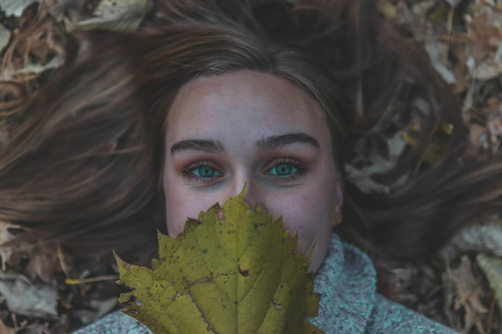

# 🎨 Image Color Correction with U-Net

This project implements a **U-Net-based deep learning model** for **image color correction**.  
It includes training, evaluation, and a **Streamlit web app** for easy inference.

---

## 📂 Dataset
We used the **MIT-Adobe FiveK dataset** (custom split):  
👉 [Dataset on Kaggle](https://www.kaggle.com/datasets/ahmedmohmedbalta/mitabovefivek)  

- **5000 RAW images**  
- **5000 color-corrected images** (aligned with RAW images)  

---

## 🚀 Features
- U-Net architecture with dropout & skip connections
- Mixed precision training with gradient clipping
- Early stopping and best model saving
- Streamlit app for inference (before/after comparison)
- TorchScript export for deployment

---

## 📂 Project Structure
```
project_root/
├── src/                    # Source code directory
│   ├── models/            # Model definitions
│   │   ├── unet.py       # U-Net architecture
│   │   └── blocks.py     # U-Net building blocks
│   ├── utils/            # Utility functions
│   │   └── transforms.py # Image transforms
│   └── app/             # Application code
│       └── main.py      # Streamlit application
├── notebooks/            # Jupyter notebooks
│   └── Train_UNet.ipynb # Training notebook
├── tests/               # Unit tests
├── models/              # Saved model checkpoints
│   └── best_model-3.pth
├── docs/                # Documentation
│   └── images/         # Documentation assets
├── configs/            # Configuration files
├── requirements.txt    # Dependencies
└── setup.py           # Package setup
```

---

## 🛠 Installation
Clone the repository and install dependencies:
```bash
git clone https://github.com/Balta8/image-color-correction-unet.git
cd image-color-correction-unet

# Create environment (recommended: Python 3.10 or 3.11)
conda create -n unet python=3.11 -y
conda activate unet

# Install dependencies
pip install -r requirements.txt
```

---
## 🧠 Trained Model
The trained model can be downloaded from Google Drive:  
👉 [Download Trained Model](https://drive.google.com/file/d/1nhhm6LbFb4JjO_VEt364W19eQVwGUBV5/view?usp=drive_link)   

⚠️ Place the model file (`best_model-3.pth`) inside the `models/` folder before running:

```bash
# Run the Streamlit app
streamlit run src/app/main.py
```
---
# Features:
- Upload a raw input image  
- Get corrected output side-by-side with the original  
- Option to download corrected image  
---

## 📷 Example Results
| Raw Input | Corrected Output |
|---------------|---------------|
|  |  |

---

## 📌 Notes
- Best model is saved as `best_model-3.pth`
- Large files (datasets, checkpoints) are ignored via `.gitignore`
- TorchScript version also available for deployment

---

## 👤 Author
Developed by **Ahmed Balta & Ahmed Elnashar**
